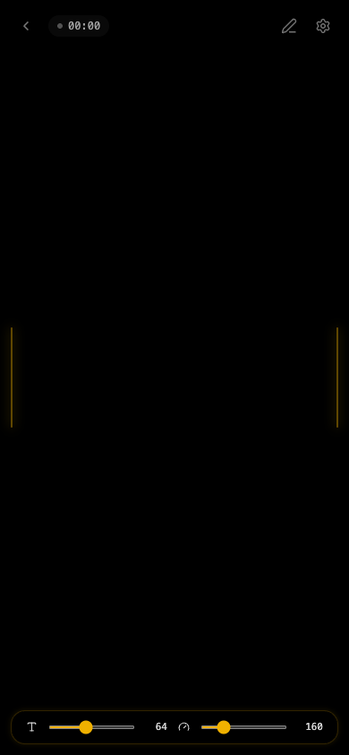
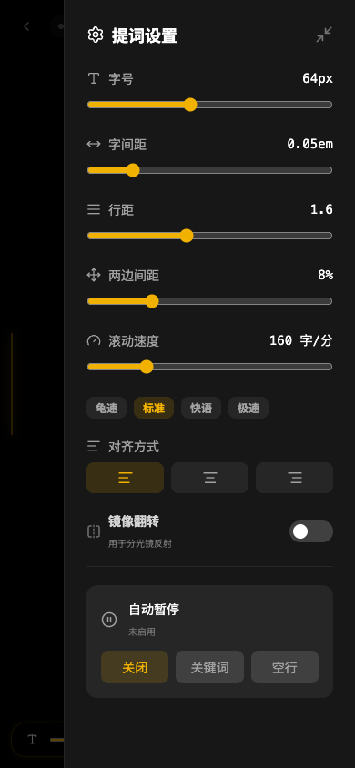

# 提词器 · Perhaps

手机提词器 —— 把手机横放架在三脚架上，大字号文字匀速滚动，省去背稿。

**纯前端、零后端**，浏览器打开即用。支持 PWA 全屏 + 离线。

---

## 功能亮点

### 提词体验

提词时，屏幕中线两侧有黄色发光竖线标记阅读区。**点击屏幕**开始/暂停滚动，**手指拖拽**自由浏览。播放时左上角指示灯亮起。底部毛玻璃工具栏在暂停时淡入，调节字号和速度。



### 智能拆分稿件

在编辑页输入或粘贴长文案，点击「智能拆分」按空行自动拆为多个独立稿件，标题自动取每段第一行。


### 自动暂停

设置自动暂停模式：**关键词**（滚动到指定词自动停）或**空行**（每段结束自动停）。暂停时顶部弹出提示，3 秒自动消失。

### 提词设置

字号、字间距、行距、两边间距、滚动速度全部可调。支持左/中/右对齐，镜像翻转（分光镜反射），速度预设一键切换。



### 稿件管理

- **字数统计**：每张卡片显示字数
- **排序**：按日期、标题、字数排序，支持升/降序
- **搜索**：实时过滤标题和内容
- **安全删除**：单篇和清空全部都有二次确认


### 键盘快捷键

| 键 | 效果 |
| --- | --- |
| `空格` | 播放 / 暂停 |
| `↑` `↓` | 加速 / 减速 |

---

## 怎么用

### 推荐：PWA（全屏 + 离线）

1. iPhone Safari 打开 **<https://jasinghuang.github.io/Prompter/>**
2. 点底部「分享」→「添加到主屏幕」
3. 从桌面图标启动 → 全屏无浏览器外壳，断网也能用

> 微信里点链接：右上角「…」→「在 Safari 中打开」再做第 2 步。

### 开发模式

```bash
npm install
npm run dev      # http://localhost:5173
npm test         # 95 个单元测试
npm run build    # 输出 dist/
```

Push 到 `main` 自动通过 GitHub Actions 部署到 GitHub Pages。

---

## 技术栈

Vite 6 · React 19 · TypeScript · TailwindCSS 4 · lucide-react · Vitest

---

## 项目结构

```
├── index.html
├── vite.config.ts
├── public/                  # PWA 图标、manifest、Service Worker
├── scripts/                 # 图标生成脚本
└── src/
    ├── main.tsx
    ├── App.tsx              # 三视图：list / prompter / editor
    ├── types.ts
    ├── lib/                 # 纯函数
    │   ├── tokens.ts        # 按码点拆字、可读字数统计
    │   ├── speed.ts         # 速度换算
    │   ├── editResolve.ts   # 编辑后阅读位置恢复
    │   ├── format.ts        # 时间格式化
    │   └── pwa.ts           # PWA 检测
    ├── store/               # localStorage 持久化
    │   ├── useScripts.ts    # 稿件 CRUD
    │   └── useSettings.ts   # 提词设置
    ├── hooks/
    │   ├── useAutoScroll.ts # 自动滚动（原生 scrollTop）
    │   ├── useTimer.ts      # 计时器
    │   ├── useWakeLock.ts   # 屏幕常亮
    │   ├── useTransientFlag.ts
    │   └── useDebouncedCallback.ts
    └── components/
        ├── Teleprompter.tsx     # 提词主视图
        ├── ScriptText.tsx       # 逐字渲染
        ├── Controls.tsx         # 底部毛玻璃控制栏
        ├── SettingsPanel.tsx    # 设置抽屉
        ├── AutoPauseControl.tsx # 自动暂停控制
        ├── ScriptEditor.tsx     # 稿件编辑
        ├── ScriptList.tsx       # 稿件列表
        └── AddToHomeScreenPrompt.tsx
```

---

## 数据存储

全部存 `localStorage`，不跨设备同步：

| Key | 内容 |
|-----|------|
| `prompter_scripts` | 稿件列表（JSON） |
| `prompter_settings` | 提词设置 |
| `prompter_pos_{id}` | 每篇进度记忆 |
| `prompter_onboarded` | 新手引导已看过 |
| `prompter_aths_dismissed` | PWA 引导已关闭 |

---

## 已知限制

| 限制 | 说明 |
|------|------|
| iOS 屏幕常亮 | Wake Lock API 在 iOS Safari 的 `file://` 下不可用，网页版正常 |
| 跨设备同步 | 不支持，各设备 localStorage 独立 |
| iOS 全屏 | 仅 PWA「添加到主屏幕」可全屏 |

---

## 许可

个人项目，自由使用。
